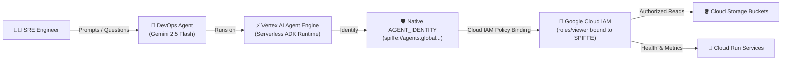

# Not Risky Anymore: Enforcing Native IAM Boundaries for Production AI Agents

> **DevFest Astana Hands-on Workshop**: Build, deploy, and secure an autonomous DevOps & SRE AI Agent using Google Cloud's **Agent Development Kit (ADK)**, **Gemini 2.5 Flash**, and **Vertex AI Agent Engine** with **Zero Service Accounts** and **Native SPIFFE Workload Identity**.

---

## 🚀 Launch Hands-on Tutorial in Cloud Shell

Click the button below to launch the interactive, guided walkthrough directly inside Google Cloud Shell:

[](https://console.cloud.google.com/agent-platform/runtimes?cloudshell_git_repo=https://github.com/alper-sari/devfest-astana.git&cloudshell_tutorial=.journey/tutorial.neos.md&show=ide&cloudshell_workspace=)

---

## 📋 Overview

Modern cloud operations require autonomous agents that can inspect infrastructure, identify security vulnerabilities, and monitor serverless workloads. However, granting static service account JSON keys or broad IAM roles to AI agents introduces severe security risks.

This workshop demonstrates Google Cloud's next-generation **Agent Identity (`AGENT_IDENTITY`)** architecture:
- **No Service Accounts**: The agent is deployed without any user-managed or default Compute Engine service account.
- **SPIFFE-Native Identity**: Google automatically provisions a cryptographically attested SPIFFE identity under `agents.global.proj-<PROJECT_NUMBER>.system.id.goog`.
- **Zero Trust Security**: The agent starts with zero access. When it tries to read resources without IAM bindings, it triggers a real-time `403 Forbidden` error. Granting permissions strictly to the SPIFFE principal unlocks secure access without distributing keys.



---

## 🛠️ Features & Agent Capabilities

The DevOps Agent includes production-ready SRE observation tools:
- 🪣 **Cloud Storage Audit**: Lists project buckets, audits Uniform Bucket-Level Access (UBLA), Public Access Prevention (PAP), Soft Delete retention, and object versions.
- 🚀 **Serverless Service Inspection**: Enumerates Cloud Run services, examines container specs, traffic splits, autoscaling limits, and health conditions.
- 🛡️ **SPIFFE Self-Verification**: Inspects and reports its own cryptographic trust domain, IAM principal URI, and security posture.
- 💰 **Resource & Cost Optimization**: Scans infrastructure and flags unattached or misconfigured resources.

---

## 📂 Repository Structure

```text
devfest-astana/
├── .journey/
│   ├── journey.svg              # Cloud Shell "Begin Tutorial" button
│   └── tutorial.neos.md         # Interactive step-by-step walkthrough
├── devops_agent/
│   ├── __init__.py              # ADK agent package initialization
│   ├── agent.py                 # Root Agent definition & Gemini 2.5 Flash config
│   ├── tools.py                 # SRE inspection tools (Storage, Run, SPIFFE)
│   ├── engine_spec.json         # AGENT_IDENTITY configuration
│   ├── requirements.txt         # Container dependencies
│   └── .env                     # Runtime environment variables
├── context.md                   # Architecture notes & reference documentation
└── README.md                    # Project documentation & Cloud Shell entrypoint
```

---

## ⚡ Quickstart (Local / Cloud Shell)

### 1. Clone & Setup
```bash
git clone https://github.com/alper-sari/devfest-astana.git
cd devfest-astana
```

### 2. Install Dependencies
```bash
python3 -m pip install --upgrade uv
uv pip install --system google-adk "google-cloud-aiplatform[adk,agent_engines]"
```

### 3. Provision Native Agent Identity
```bash
curl -X POST \
  -H "Authorization: Bearer $(gcloud auth print-access-token)" \
  -H "Content-Type: application/json" \
  -d @devops_agent/engine_spec.json \
  https://us-central1-aiplatform.googleapis.com/v1beta1/projects/YOUR_PROJECT_ID/locations/us-central1/reasoningEngines \
  -o create_engine.json
```

### 4. Deploy Agent Code
```bash
adk deploy agent_engine \
  --project=YOUR_PROJECT_ID \
  --region=us-central1 \
  --agent_engine_id=YOUR_ENGINE_ID \
  devops_agent
```

---

## 🏆 DevFest Astana Presentation Highlights

1. **Compare Models**: Explain how **Gemini 2.5 Flash** brings state-of-the-art agentic tool calling and reasoning with sub-second latency.
2. **Demonstrate Zero Trust**: Show the agent failing with `403 Forbidden` before permissions are granted, proving that no ambient service account access exists.
3. **Grant Granular IAM**: Bind `roles/viewer` directly to `principalSet://agents.global.proj-<NUM>.system.id.goog/attribute.platformContainer/aiplatform/projects/<NUM>` and watch the agent immediately succeed.

---

## 👨‍💻 Workshop Author

**Alper Sarı**  
*Google Developer Expert (GDE) on Google Cloud*  
*DevFest Astana*

---

## 📄 License

Apache 2.0 - Developed for DevFest Astana workshops.
